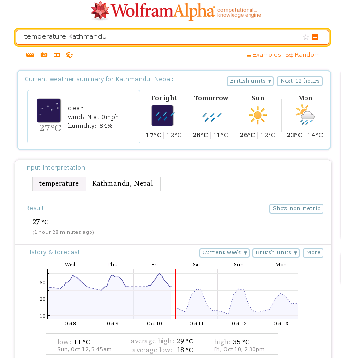
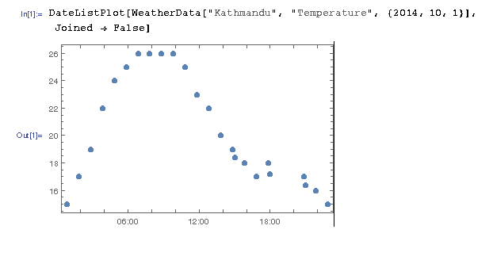
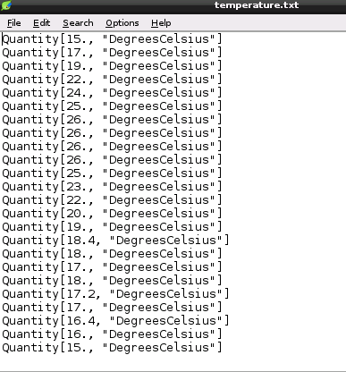

# Worksheet
## Step 1: Find some weather data

We’re going to download some weather data, and turn it into sound. There are many online sources of weather data, but one is built into the Raspbian software—Mathematica. We can get an idea of the type of data available from Mathematica by querying the Wolfram Alpha website (this is from the same company, Wolfram which makes Mathematica).

## Activity checklist:

1. Launch the Epiphany web browser and navigate to [http://www.wolframalpha.com/](http://www.wolframalpha.com/). This allows you to type in queries and get data answers—like a search engine for live data. 
1. Try a query to find temperatures in a given location (substitute your favourite town/city)

    `temperature Kathmandu`
    
    You will see a result such as
    
    

    …so, if we could get the temperature datapoints which are plotted on the graph into Sonic Pi, we could play notes corresponding to them. Mathematica has access to many datasets, including the weather ones, so the next step is to load it.
    
## Step 2: Look at weather data from Mathematica

1. Quit Epiphany—Mathematica needs all the memory it can get!
2. Launch Mathematica from the desktop icon or by clicking on the Main Menu, then Education, then Mathematica. It will take a little while to load; you can see its progress from messages displayed over the image.
    Mathematica is a huge and complex system, but it has excellent documentation, which we can use to see how to access weather information. We’ll use a function called `WeatherData`.
    
    >WeatherData   (Built-in Mathematica Symbol)
WeatherData[loc, " property"] gives the most recent measurement for the specified weather property at the location corresponding to loc. WeatherData[loc, " property", date] ...

    >~[Mathematica documentation centre](http://reference.wolfram.com/documentation-search.html?query=weatherdata)
    
The format of the weather function is

```
WeatherData[“<name of place>”, “<property to get>”, {<year,><month>,<day>}]
```
 …where the parts in angle brackets get replaced with the desired values, 
 On starting Mathematica will open a ‘notebook’ window. A useful way to check the data we will use is to plot it as a graph. If you click in the window and type in the command
 
```
 	DateListPlot[WeatherData[“Kathmandu”, "Temperature", {2014, 10, 1}],  Joined -> False]
```
 	
then hold SHIFT and press ENTER (which tells Mathematica to process your input). It will start processing and display your input as `In[1]:=…`. This will take a _long, long_ time the first time you run a query as Mathematica downloads data sources—maybe 10 minutes or so. Now is the time to go and make a cup of tea…

Finally, you should see a result like this:



Each point on the graph corresponds to a temperature in °C during a day. 

## Step 3: Save the weather data in a file

To get the data into Sonic Pi, the easiest way is to write it into a text file, which Sonic Pi can then read. To do this execute

```
Export[“temperature.txt”, WeatherData[“Kathmandu”, “Temperature”, {2014, 10, 1}][“Values”]]
```

This will create a file called `temperature.txt`. Take a look at it by opening Main menu>Accessories>Leadpad and opening the `.txt` file. You’ll see formatted data



which shows the temperatures as Mathematica `Quantity` values (these have both a _size_ and a _unit_ part). We can now use Sonic Pi to ‘play’ the temperatures we’ve collected.


